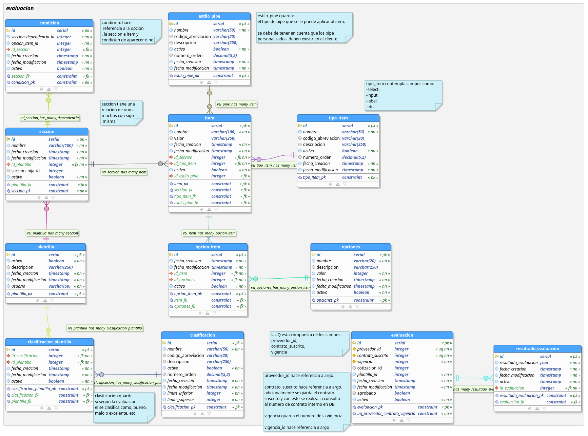

# evaluacion_crud

evaluacion_crud, CRUD para la gestion de formatos de evaluación del sistema Agora. El proyecto está escrito en el lenguaje Go. generado mediante el **[framework beego](https://beego.me/)**.

## Base de Datos

### Modelo de Datos
El modelo de datos se comparte en imagen y en **[.dbm](https://drive.google.com/open?id=1Td88yP3jA7Y_kbAzPaOxE2nn41Teu7tl)** para que pueda ser editado en pgModeler.

### SQL del Modelo de Datos
**[SQL evaluacion_proveedores](https://drive.google.com/open?id=1mZLmSuDIbQzwIidVCA29c9LCFWljMZoG)**.
Registros paramétricos a tener encuenta: **[Parametricas](https://drive.google.com/open?id=1gUK_4g_-vU1LwKsgO_xsMG0yUWGADm9OZRF3fiDRBXg)**.

## Instalación

### Requerimientos
- [Postgres](https://www.postgresql.org/)
- [Golang](https://github.com/udistrital/introduccion_oas/blob/master/instalacion_de_herramientas/golang.md)
- [Beego y Bee](https://github.com/udistrital/introduccion_oas/blob/master/instalacion_de_herramientas/beego.md)


Para instalar el proyecto de debe relizar lo siguientes pasos:
#### Opción 1

Ejecutar desde la terminal 'go get repositorio':
```javascript
go get github.com/udistrital/evaluacion_crud
```

#### Opción 2

Clonar en el proyecto en la carpeta local: go/src/github.com/udistrital:
```javascript
cd ~go/src/github.com/udistrital 
```

Ejecutar:
```javascript
git clone https://github.com/udistrital/evaluacion_crud
```

Ir a la carpeta del proyecto
```javascript
cd evaluacion_crud
```
Instalar dependencias del proyecto:
```javascript
go get
```

## Ejecucion del proyecto

```javascript
 bee run -downdoc=true -gendoc=true
```
- El servidor se expone en el puerto: 127.0.0.1:8089
- Para ver la documentación de swagger: 127.0.0.1:8089/swagger/


<hr>

## Derechos de Autor

This program is free software: you can redistribute it and/or modify it under the terms of the GNU General Public License as published by the Free Software Foundation, either version 3 of the License, or (at your option) any later version.

This program is distributed in the hope that it will be useful, but WITHOUT ANY WARRANTY; without even the implied warranty of MERCHANTABILITY or FITNESS FOR A PARTICULAR PURPOSE. See the GNU General Public License for more details.

##### UNIVERSIDAD DISTRITAL FRANCISCO JOSÉ DE CALDAS
##### OFICINA ASESORA DE SISTEMAS
##### 2019